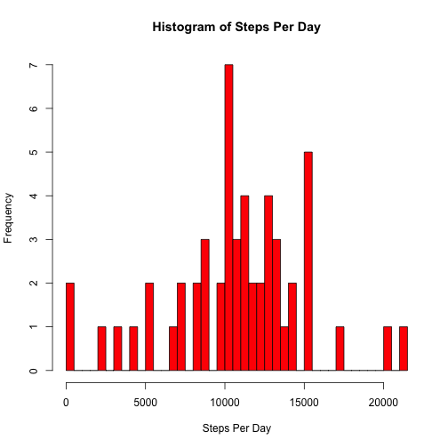
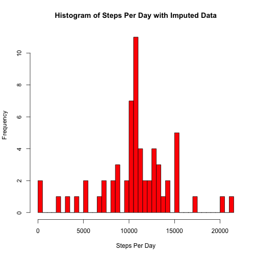
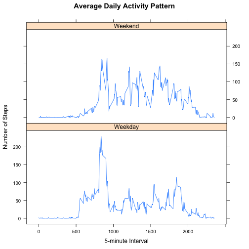

```r
library(knitr)
opts_chunk$set(echo = TRUE)
```

## Loading and preprocessing the data

```r
convertIntervalToTime<-function(interval){
   t<-NULL
   x<-1
   for(i in interval){
        hour <- as.integer(i) %/% 100
        minute <- as.integer(i) %% 100
        newTime<-paste(sprintf("%02d", hour), ":", sep="")
        newTime<-paste(newTime, sprintf("%02d", minute), sep="")
        newTime<-paste(newTime, ":00", sep="")
        t[x]<-newTime
        x<-x+1
   }
   t
}

convertToDate<-function(date, interval=NULL) {
   time<-convertIntervalToTime(interval)
   from<-paste(date, time, sep=" ");  
   strptime(from, "%Y-%m-%d %H:%M:%S", tz="GMT")
} 

data<-read.csv("activity.csv")
data$datePOSIX<-convertToDate(data$date, data$interval)
# add day of week column to data
data <- cbind(data, weekday=weekdays(data$datePOSIX))
```

## What is mean total number of steps taken per day?


```r
stepsPerDay <- aggregate(steps ~ date, data = data, FUN = sum)
```

1. Make a histogram of the total number of steps taken each day

```r
hist(stepsPerDay$steps, breaks=nrow(stepsPerDay), main="Histogram of Steps Per Day", xlab="Steps Per Day", col = "red")
```

 

2. Calculate and report the **mean** and **median** total number of steps taken per day

```r
stepsPerDayMean<-mean(stepsPerDay$steps)
stepsPerDayMedian<-median(stepsPerDay$steps)
```

The **mean** total steps per day is 1.0766 &times; 10<sup>4</sup>  
The **median** total steps per day is 10765  

## What is the average daily activity pattern?

1. Make a time series plot (i.e. type = "l") of the 5-minute interval (x-axis) and the average number of steps taken, averaged across all days (y-axis)

```r
stepsPerInterval <- aggregate(steps ~ interval, data = data, FUN = mean)

with(stepsPerInterval, {
   plot(interval, steps, type = "l", main = "Average Daily Activity Pattern", xlab = "5-minute Interval", ylab = "Average Steps Across Days")
}
)
```

 

2. Which 5-minute interval, on average across all the days in the dataset, contains the maximum number of steps?

```r
maxInterval<-stepsPerInterval$interval[which.max(stepsPerInterval$steps)]
```

The interval with the maximum number of steps is 835

## Imputing missing values

1. Calculate and report the total number of missing values in the dataset (i.e. the total number of rows with NAs)


```r
numberMissing<-sum(is.na(data$steps))
```

The number of missing values is 2304

2. Devise a strategy for filling in all of the missing values in the dataset. The strategy does not need to be sophisticated. For example, you could use the mean/median for that day, or the mean for that 5-minute interval, etc.

I used the mean for that 5-minute interval.

3. Create a new dataset that is equal to the original dataset but with the missing data filled in.

```r
getMeanForInterval<-function(interval){
  mean<-stepsPerInterval$steps[stepsPerInterval$interval==interval]
  mean
}

getImputedData<-function(data){
  rows<-nrow(data)
  imputedData<-NULL
  x <- 1

  while(x <= rows){
    if(is.na(data[x,]$steps)){
      imputedData[x] = getMeanForInterval(data[x,]$interval)
    } else {
      imputedData[x] = data[x,]$steps
    }
    x<-x+1
  }
  cbind(data, imputedSteps=imputedData)
}

imputedData<-getImputedData(data)
```

4. Make a histogram of the total number of steps taken each day and Calculate and report the mean and median total number of steps taken per day. Do these values differ from the estimates from the first part of the assignment? What is the impact of imputing missing data on the estimates of the total daily number of steps?


```r
imputedStepsPerDay <- aggregate(imputedSteps ~ date, data = imputedData, FUN = sum)
```


```r
hist(imputedStepsPerDay$imputedSteps, breaks=nrow(imputedStepsPerDay), main="Histogram of Steps Per Day with Imputed Data", xlab="Steps Per Day", col = "red")
```

 


```r
imputedStepsPerDayMean<-mean(imputedStepsPerDay$imputedSteps)

imputedStepsPerDayMedian<-median(imputedStepsPerDay$imputedSteps)

stepsPerDaySd<-sd(stepsPerDay$steps, na.rm=TRUE)
imputedStepsPerSd<-sd(imputedStepsPerDay$imputedSteps)
```

The **mean** for the data with the missing values is 1.0766 &times; 10<sup>4</sup>  
The **mean** for the data with the imputed values is 1.0766 &times; 10<sup>4</sup>  

The **median** for the data with the missing values is 10765  
The **median** for the data with the imputed values is 1.0766 &times; 10<sup>4</sup>

The **standard deviation** for the data with the missing values is 4269.1805  
The **standard deviation** for the data with the imputed values is 3974.3907  


```r
t.test(imputedStepsPerDay$imputedSteps, stepsPerDay$steps)
```

```
## 
## 	Welch Two Sample t-test
## 
## data:  imputedStepsPerDay$imputedSteps and stepsPerDay$steps
## t = 0, df = 107.1, p-value = 1
## alternative hypothesis: true difference in means is not equal to 0
## 95 percent confidence interval:
##  -1539  1539
## sample estimates:
## mean of x mean of y 
##     10766     10766
```

## Are there differences in activity patterns between weekdays and weekends?

1. Create a new factor variable in a dataset with two levels - "weekday" and "weekend" indicating a given date is a weekday or a weekend day


```r
weekend <- c("Saturday", "Sunday")
weekdayWeekend <- imputedData$weekday %in% weekend
weekdayWeekendFactor <- factor(weekdayWeekend, labels = c("Weekday", "Weekend"))
imputedData <- cbind(imputedData, weekdayWeekendFactor=weekdayWeekendFactor)
```

2. Make a panel plot containing a time series plot (i.e. type = "l") of the 5-minute interval (x-axis) and the average number of steps taken, averaged across all weekday days or weekend days (y-axis).


```r
library(lattice) 
# kernel density plots by factor level 
stepsPerIntervalWeekdayWeekend <- aggregate(imputedSteps ~ interval + weekdayWeekendFactor, data = imputedData, FUN = mean)

xyplot(imputedSteps~interval|weekdayWeekendFactor, data=stepsPerIntervalWeekdayWeekend, type="l", layout = c(1, 2),
    main="Average Daily Activity Pattern",
   xlab="5-minute Interval",  ylab = "Number of Steps")
```

 
